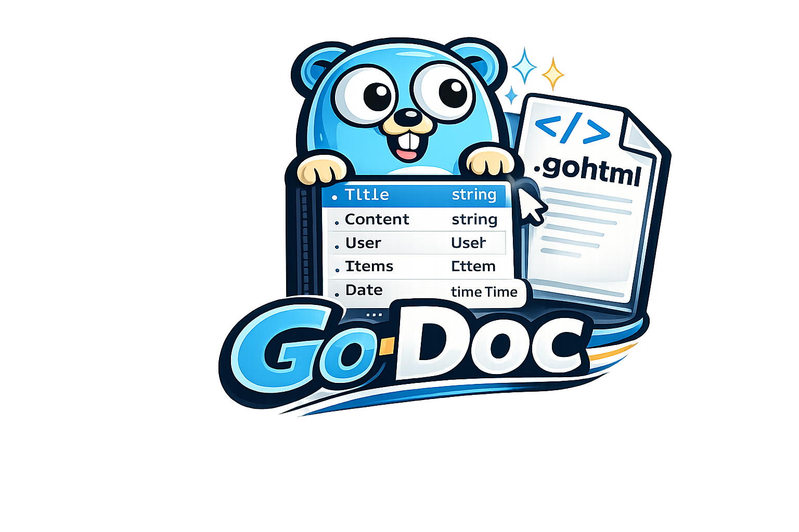

<p align="center">
    
</p>

`go-doc` brings typed editor tooling to Go templates.

It reads lightweight typed-root annotations, `@dot`, `@func`, `@gen`, and project-defined
annotations in `.gohtml`, `.tmpl`, and `.html` templates, scans exported Go
structs and functions in your module, and serves that knowledge to editors
through a small Language Server Protocol server.

```gotemplate
{{/*
@model Page github.com/example/app.Page
*/}}

<h1>{{ Page.Title }}</h1>

{{ range Page.Items }}
    <a href="/items/{{ .ID }}">{{ .Label }}</a>
{{ end }}
```

With that contract in place, editors can complete fields, validate unknown
members, understand `range` dot context, show hover information, and navigate
back to Go source.

This is a two-way contract, not magic. The annotation is the template-side
entrance: it tells go-doc and the editor that `Page` should be an
`github.com/example/app.Page`. Your application still provides the runtime
exit: it must register a `Page` accessor before parsing, for example through
the optional `renderer`, or through equivalent application glue.

Plain `html/template` dot execution is different. If you call
`tmpl.Execute(w, page)`, the template receives `page` as `.`, so the matching
contract is `@dot`, not `@model`.

## Why

Go templates are intentionally simple at runtime, but that usually means the
editor has no idea what `{{ .Title }}` or `{{ Page.Items }}` refers to.

`go-doc` keeps runtime behavior unchanged. Your application still owns template
parsing, execution, routing, rendering, and data. `go-doc` only adds a typed
contract that editors and tools can understand.

## Features

- Typeahead for typed roots, built-in
  and custom template functions, exported fields, and exported methods.
- Dot-context completion inside `range` and `with` blocks.
- Diagnostics for unknown typed roots, fields, invalid `range` sources, and bad
  function calls.
- Include checks for `template`, `block`, same-file `define`, and cross-file
  child templates that declare `@dot`.
- Quick fixes for creating missing model structs and adding missing struct
  fields from template diagnostics.
- Hover and go-to-definition for typed root types, fields, methods, functions, and
  template includes.
- Semantic highlighting for typed root types, typed root names,
  built-in functions, custom functions, fields, and methods.
- A shared LSP core used by GoLand, VS Code, Sublime Text, Vim, and Neovim.
- Optional `.go-doc/index.json` generation for CI, debugging, and tool
  interoperability.

## Install

Install the CLI:

```bash
go install github.com/donseba/go-doc@latest
```

Install the experimental helper generator when using `@gen`:

```bash
go install github.com/donseba/go-doc/cmd/godoc-exp-gen@latest
```

Then install the editor package you use from the release assets.

On Windows, the GoLand and VS Code integrations run the long-lived language
server from a temporary copy of `go-doc.exe`. That keeps `go install
github.com/donseba/go-doc@latest` able to replace the installed binary while the
editor is open. Restart the LSP/editor to pick up the newly installed version.
The editor status commands show both the installed CLI version and the active
LSP copy version.

| Editor | Package |
| --- | --- |
| GoLand | `go-doc-goland-plugin-*.zip` |
| VS Code | `go-doc-vscode-*.vsix` |
| Sublime Text | `go-doc-sublime-*.sublime-package` |
| Vim | `go-doc-vim-*.zip` |
| Neovim | `go-doc-neovim-*.zip` |

## Quick Start

Use the model in a template:

```gotemplate
{{/*
@model Todo github.com/example/app.Todo
*/}}

<article>
    <h2>{{ Todo.Title }}</h2>
    <p>{{ Todo.Priority }}</p>
</article>
```

The declared model name is the template accessor. `@model Todo ...` is used as
`{{ Todo.Title }}`. At runtime, that accessor must exist. The optional renderer
creates it by matching the declared type to a Go value and adding a template
function named `Todo` before parsing. Without that runtime registration,
`html/template` has no built-in idea what `Todo` means.

Capitalized model names are recommended because they read like Go types and
avoid common template helper names, but lowercase names are not forbidden.
go-doc reports a diagnostic when a model name collides with a built-in,
configured, or local template function, because the same identifier cannot
reliably be both a model accessor and a function in `html/template`.

Use `@dot` when the template is rendered with dot set to one value, such as a
table row or card:

```gotemplate
{{/* @dot github.com/example/app.User */}}
<tr>
    <td>{{ .Name }}</td>
    <td>{{ .Status }}</td>
</tr>
```

Use `@dot` for normal `tmpl.Execute(w, value)` templates where the value is
available as `.`:

```gotemplate
{{/* @dot github.com/example/app.Page */}}
<h1>{{ .Title }}</h1>
```

When a parent calls that child with `{{ template "user_row.gohtml" . }}`,
go-doc checks that the passed value matches the child `@dot` contract. The same
check applies to named `define` sections and `block` calls.

Use `@func` for custom helpers that are local to one template:

```gotemplate
{{/*
@func userByID github.com/example/app.UserByID
*/}}

{{ (userByID 2).Name }}
```

For helpers available everywhere, prefer `.go-doc/config.json` so you do not
repeat the same `@func` declarations across templates.

Configured helpers are still a two-way road. The config teaches go-doc what the
editor should expect, but your Go application must still register the actual
function in the `html/template.FuncMap`.

For simple one-signature helpers, `functions` is enough:

```json
{
  "functions": {
    "formatDate": "github.com/example/app.FormatDate"
  }
}
```

### Global FuncMaps

For projects that already collect helpers in a Go `template.FuncMap`, go-doc can
read direct static FuncMap literals instead of making you repeat every helper in
`functions`.

For small projects, annotate the FuncMap:

```go
//go-doc:funcmap
func TemplateFuncs() template.FuncMap {
    return template.FuncMap{
        "asset": Asset,
    }
}
```

Variables work too:

```go
//go-doc:funcmap
var TemplateFuncs = template.FuncMap{
    "asset": Asset,
}
```

For larger projects, prefer explicit config:

```json
{
  "functionMaps": [
    "github.com/example/app.TemplateFuncs"
  ]
}
```

`functionMaps` and `//go-doc:funcmap` are statically analyzed. go-doc does not
execute Go code or use reflection. For v1, use direct composite literals such as
`template.FuncMap{...}`, `map[string]any{...}`, or
`map[string]interface{}{...}`. Dynamic construction is reported as unsupported:

```go
func TemplateFuncs() template.FuncMap {
    fm := template.FuncMap{}
    fm["asset"] = Asset
    return fm
}
```

Function sources are merged from broadest to most explicit:

```text
built-ins < annotated funcmaps < config.functionMaps < config.functions < local @func
```

For helpers with multiple accepted call forms, use `templateFunctions`:

```json
{
  "templateFunctions": [
    {
      "name": "async",
      "path": "github.com/donseba/go-partial/templatefunctions.Async",
      "signatures": [
        "func(endpoint string, params ...any) html/template.HTML",
        "func(interaction github.com/donseba/go-partial.Interaction) html/template.HTML"
      ]
    }
  ]
}
```

If `signatures` is omitted, go-doc reads `//go-doc:sig` comments from the
function at `path`. Configured template function packages are loaded directly,
so this also works for helper packages that live in dependencies:

```go
//go-doc:sig func(endpoint string, params ...any) html/template.HTML
//go-doc:sig func(interaction github.com/donseba/go-partial.Interaction) html/template.HTML
func Async() {}
```

Request-scoped helpers that are installed as closures can put `//go-doc:sig`
directly above the FuncMap assignment. go-doc infers the template function name
from the static string key:

```go
//go-doc:sig func() *net/url.URL
funcs["url"] = func() *url.URL {
    return state.URL
}
```

Any non-special annotation with a name and type becomes a typed root: a named
value that go-doc can complete, validate, hover, and navigate. `@model` is the
recommended convention for page or fragment data. `@symbol`, `@component`,
`@interaction`, or your own project vocabulary work the same way when they
declare a type:

```gotemplate
{{/*
@symbol LikesPoll github.com/example/app.Interaction
*/}}

{{ LikesPoll.ID }}
```

Every typed root is still a two-way contract. The annotation tells go-doc the
expected type, but your runtime must still register the actual template accessor
or function that makes `LikesPoll` available. The annotation word is vocabulary,
not a different engine path.

Any custom annotation with an explicit type is accepted by default:

```gotemplate
{{/*
@component Button github.com/example/ui.Button
@interaction LikesPoll github.com/donseba/go-partial.Interaction
*/}}
```

Projects can define shorter symbol annotations in `.go-doc/config.json`. This
lets framework packages expose their own vocabulary without hard-coding it into
go-doc, and it lets stricter teams decide which annotation names are allowed:

```json
{
  "symbolAnnotations": [
    {
      "name": "interaction",
      "type": "github.com/donseba/go-partial.Interaction"
    },
    {
      "name": "component"
    }
  ]
}
```

With that configuration, templates can write:

```gotemplate
{{/*
@interaction LikesPoll
@component Button github.com/example/ui.Button
*/}}
```

`@interaction LikesPoll` gets the configured default type. `@component Button`
requires an explicit type because its config entry has no default type. These
aliases behave like normal typed roots after parsing. `@func` remains the right
annotation for callable helpers, because it carries function signatures, arity
checks, argument checks, pipelines, and return types.

By default, custom annotation names are open. `@jimmy Button
github.com/example/ui.Button` is valid because it includes an explicit type. Set
`symbolStrictMode: true` when you want go-doc to warn about unconfigured custom
annotation names. In strict mode, only entries listed in `symbolAnnotations`
are accepted as custom typed-root annotations.

## Configuration

No `.go-doc` folder is required. By default, `go-doc` finds the nearest
`go.mod`, scans that module in memory, skips `vendor`, and does not write
`.go-doc/index.json`.

The default configuration is:

```json
{
  "enabled": true,
  "include": ["/"],
  "exclude": ["vendor"],
  "functions": {},
  "functionMaps": [],
  "discover": {
    "functionMaps": true
  },
  "templateFunctions": [],
  "symbolAnnotations": [],
  "symbolStrictMode": false,
  "writeIndex": false
}
```

Add `.go-doc/config.json` only when a project needs to change those defaults:

```json
{
  "enabled": true,
  "include": ["/"],
  "exclude": ["vendor", "tmp", "internal/generated"],
  "writeIndex": false,
  "functions": {
    "asset": "github.com/example/app.Asset",
    "formatDate": "github.com/example/app.FormatDate"
  },
  "functionMaps": [
    "github.com/example/app.TemplateFuncs"
  ],
  "discover": {
    "functionMaps": true
  },
  "templateFunctions": [
    {
      "name": "async",
      "path": "github.com/donseba/go-partial/templatefunctions.Async"
    }
  ],
  "symbolAnnotations": [
    {
      "name": "component"
    }
  ],
  "symbolStrictMode": false
}
```

Entries are module-relative paths. `/` means the module root. Excludes win over
includes. `enabled: false` disables go-doc for the project while leaving the
editor plugin installed. `functions` describes helpers that are available in every template so
the language server can complete and validate them without repeating `@func` in
each file. `functionMaps` describes whole static Go FuncMap declarations whose
string-keyed entries should be available in every template. `discover.functionMaps`
defaults to `true` and enables scanning included Go files for
`//go-doc:funcmap` annotations. `templateFunctions` is the richer form for
helpers that need multiple signatures or use `//go-doc:sig` comments as their
source of truth. `//go-doc:sig` can annotate a named Go function or a closure
assignment such as `funcs["url"] = func(...) { ... }`.
`symbolAnnotations` describes custom annotation names that produce typed roots.
Use this for framework concepts such as `@interaction`, `@component`,
or any project-specific template value that should be completed and navigated
like a named root value but is not a callable function. `symbolStrictMode` defaults to
`false`; when set to `true`, unconfigured custom annotation names are reported as
typos even if they include an explicit type.

`writeIndex` controls editor auto-indexing. Keep it `false` unless you want editor
adapters to maintain `.go-doc/index.json` after file changes. Even when it is
false, the language server still builds an in-memory index and all editor
features continue to work.

## Optional Index File

The generated index is an optional artifact, not the project root marker.
`go-doc` uses `go.mod` to find the module root.

Create the file explicitly when you want a concrete artifact for CI, debugging,
or other tools:

```bash
go-doc index -o .go-doc/index.json .
```

`go-doc index` only writes an index when at least one template declares a typed
contract, or when `.go-doc/config.json` declares global template functions. If
no typed template surface exists, the command exits successfully without
creating `.go-doc/index.json`.

## Commands

```bash
go-doc types [-query Todo] [root]
go-doc templates [root]
go-doc index [-o .go-doc/index.json] [root]
go-doc lsp [root]
```

## Language Server

`go-doc lsp` starts a Language Server Protocol server over stdio. It is the
shared implementation used by all editor packages.

The server builds an in-memory index from the module root by default. It reads
`.go-doc/index.json` only when `.go-doc/config.json` opts into `"writeIndex": true`.
Completion, diagnostics, hover, go-to-definition, semantic tokens, and include
checks still work without a `.go-doc` folder.

## Experimental Generation

`@gen` explores generated helper namespaces for templates:

```gotemplate
{{/*
@gen time github.com/example/app/internal/timefuncs
@gen money github.com/example/app/internal/moneyfuncs
*/}}

{{ time.Format Page.GeneratedAt "15:04:05" }}
{{ money.EUR .MonthlyCents }}
```

This is not a runtime import. The generator writes ordinary Go code that exposes
a normal `template.FuncMap`, and the editor understands the generated namespace
through the same LSP index.

Keep the source helpers in ordinary application packages and generate one small
bridge package:

```text
internal/timefuncs/timefuncs.go
internal/moneyfuncs/moneyfuncs.go

gen/gen.go
```

```bash
godoc-exp-gen \
  -package gen \
  -out gen/gen.go
```

Register the generated helpers before parsing:

```go
tmpl := template.New("page.gohtml").Funcs(gen.FuncMap())
```

That FuncMap only provides helper namespaces. Named typed roots such as `Page` still
need the renderer or equivalent application glue described below.

See [README_gen.md](./README_gen.md) and [examples/exp-gen](./examples/exp-gen)
for the full explanation.

## Runtime Integration

`go-doc` does not require a framework. It does not execute your templates or
change how your application renders HTML.

For projects that want annotated typed-root names available during ordinary
`html/template` parsing, the repository includes a small `renderer` package. It
can scan the same template declarations, match them to the Go values you pass,
and register the declared typed-root accessors before parsing:

Think of `@model` as a tunnel. The template declares the entrance:

```gotemplate
{{/* @model Page github.com/example/app.Page */}}
<h1>{{ Page.Title }}</h1>
```

The renderer creates the exit by registering a template function named `Page`
that returns the matching Go value:

Create one renderer for a template set. Use `renderer.Development` while
editing templates, or `renderer.Production` when you want contracts scanned once
at startup:

```go
views, err := renderer.New(renderer.Config{
    Mode:  renderer.Development,
    Files: []string{"templates/page.gohtml"},
    Funcs: template.FuncMap{
        "asset":      app.Asset,
        "formatDate": app.FormatDate,
    },
})
```

The render path stays the same in both modes:

```go
tmpl := template.New("page.gohtml")
err := views.Register(tmpl, page)
_, err = tmpl.ParseFiles("templates/page.gohtml")
```

If `views.Register` is omitted, `Page.Title` is not valid plain
`html/template` syntax. Use `@dot` and `.Title` instead when executing directly
with `tmpl.Execute(w, page)`.

`Config.Funcs` is the runtime counterpart to `.go-doc/config.json` functions:
the config teaches editors about globally available helpers, while the renderer
registers the real Go functions with `html/template`.

Development mode re-reads `@model` declarations on each `Register` call, so
template-side renames are picked up without restarting. Production mode reads
the declarations once in `renderer.New`, avoiding repeated file reads and
keeping the render path predictable.

The standalone example in `examples/standalone` shows this without depending on
`go-partial`.

The todo example in `examples/todo` shows a small multi-template setup with a
main shell, todo list, and todo detail template.

The symbols example in `examples/symbols` shows configured symbol annotations
such as `@interaction` and `@component`, plus the runtime `FuncMap` that makes
those names available to `html/template`.

## Local Development

This repository includes a `Taskfile.yml` for common local commands.

Install Task first:

```bash
go install github.com/go-task/task/v3/cmd/task@latest
```

Useful tasks:

```bash
task doctor
task install:tools
task test
task build:goland
task build:vscode
task build:sublime
task build:vim
task build:neovim
task dist
```

`task install:tools` can install the local development toolchain for your
platform. On Windows it uses Scoop to install Go, Node.js, JDK 17, and Gradle.
On macOS it uses Homebrew.

## Release Assets

Build outputs are collected locally in `dist`.

Release archives contain editor packages only. The CLI is distributed through:

```bash
go install github.com/donseba/go-doc@latest
go install github.com/donseba/go-doc/cmd/godoc-exp-gen@latest
```
